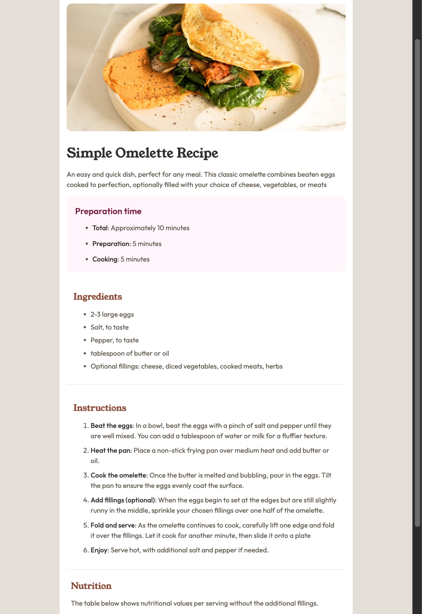

# Frontend Mentor - Recipe page solution

This is a solution to the [Recipe page challenge on Frontend Mentor](https://www.frontendmentor.io/challenges/recipe-page-KiTsR8QQKm). Frontend Mentor challenges help you improve your coding skills by building realistic projects.

## Table of contents

- [Overview](#overview)
  - [The challenge](#the-challenge)
  - [Screenshot](#screenshot)
  - [Links](#links)
- [My process](#my-process)
  - [Built with](#built-with)
  - [What I learned](#what-i-learned)

## Overview

challenge is to build out this recipe page and get it looking as close to the design as possible.

### Screenshot

**Note: Delete this note and the paragraphs above when you add your screenshot. If you prefer not to add a screenshot, feel free to remove this entire section.**

### Links

- Solution URL: https://github.com/SurajChaunal/frontend-mentor-recipe-component.git
- Live Site URL:https://surajchaunal.github.io/frontend-mentor-recipe-component/

## My process

### Built with

- Semantic HTML5 markup
- CSS custom properties
- Flexbox
- Table layout

**Note: These are just examples. Delete this note and replace the list above with your own choices**

### What I learned

learned to make long component using box model, flexbox , and relative css using rem, %, max-width;
